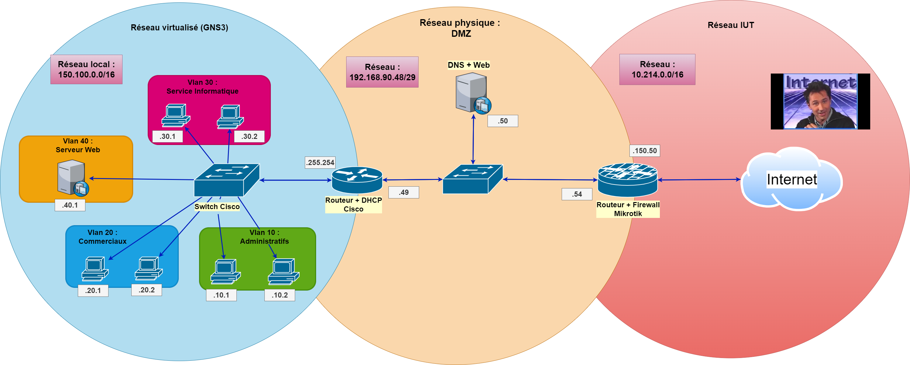
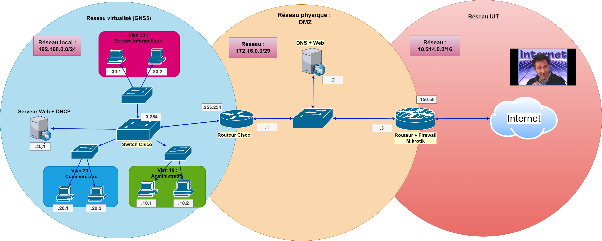

# Carnet de bord individuel pour la SAE 21 :

## Jours : 
* [Mardi 29/03 (Schéma réseau)](#mardi-2903-schéma-réseau)
* [Vendredi 01/04 (Configuration serveur web)](#vendredi-0104-configuration-serveur-web)
* [Lundi 04/04 (Sécurisation serveur web)](#lundi-0404-sécurisation-serveur-web)
* [Mardi 05/04 (Routeur,Vlan,DHCP)](#mardi-0504-routeurvlandhcp)
* [Jours](#carnet-de-bord-individuel-pour-la-sae-21)

----

## **Mardi 29/03 (Schéma réseau) :**

### *Le plus important avant de commencer quoi que ce soit de concret pour la réalisation du réseau de l'entreprise, il faut faire un plan. Il faut donc réfléchir sur quel réseau nous allons placer nos 3 zones distinctes, combien il y aura de machines en total, en bref avoir une vue concrète pour nous simplifier la vie et ne pas partir dans tout les sens.*          
 

### Pour cela j'ai donc utiliser l'extension Draw.io disponible sur VisualStudio et j'ai pu réaliser ce schéma-ci : 
 

 

### Il y aura donc dans notre réseau d'entreprise 3 zones distinctes :   
 

### - La partie réseau entreprise en bleu qui sera virtualisé, avec un serveur Web, les différents répartissements du réseau entre chaque branches du réseau (Administratifs, etc...), tous répartis dans des Vlan **pour plus de sécurité**. **J'ai également choisi un réseau en /16** pour plus de flexibilité et pouvoir adresser les machines sous la forme : **150.100.Vlan.Machine**
  

### - Il y a également la DMZ, la partie physique du réseau (en orange au centre) que nous allons réaliser avec un routeur Mikrotik qui fera également office de pare-feu, un switch puis une machine qui servira de DNS ainsi que de serveur Web. **J'ai choisi un plan d'adressage en /30** également pour des raisons de **sécurité** pour ne pas qu'une machine étrangère au réseau puisse se connecter.
 

### - Finalement, il y a le réseau de l'IUT en rouge, que nous gérons pas et qui est adressé en 10.214.0.0/16.

------

## **Vendredi 01/04 (Configuration serveur web) :** 
 

### Pour les différents serveurs Web, j'ai choisi d'utiliser le module apache2 disponible sur Debian car il est très simple et rapide à mettre en place mais aussi parce-que nous avons fait plusieurs TP dessus.

### J'ai également réalisé une mini page Web simple en HTML/CSS pour avoir quelque chose à afficher sur nos serveurs : 
 

 

### Pour pouvoir **mettre en place le service apache2** sur une machine **Linux** et en respectant les règles basiques de sécurité, il faut suivre une procédure très simple :
   

### Tout d'abord on installe la dernière version (**pour éviter les failles de sécurité connues**) du service apache2 :
    sudo apt install apache2

### Une fois fait, il faut se diriger vers les fichiers de configuration :
    cd /etc/apache2/sites-available

### Nous copions le fichier de configuration de base en un autre qu'on appellera comme on le veut : 
    cp 000-default.conf site.conf

### Finalement, on met les bonnes configurations dans le fichier avec l'éditeur de notre choix :
    sudo nano site.conf

A completer

-----------

## **Lundi 04/04 (Sécurisation serveur web) :** 
 

### Finalement, pour compléter mon travail sur les différents serveurs web qu'il y aura dans notre plan de réseau, je me suis penché sur l'aspect sécurisation d'un serveur apache2.
   

### On modifiera les éléments dans les fichiers de configuration suivants : 
    /etc/apache2/apache2.conf

### Ainsi que pour le virtual host du serveur :
    /etc/apache2/sites-available/site.conf

----------

## **Mardi 05/04 (Routeur,Vlan,DHCP) :** 
 

### Je me suis occupé également des différents switchs et routeur Cisco que nous aurons dans le réseau final. J'ai donc écrit un petit mémo pour pouvoir configurer rapidement les différentes interfaces du routeur, puis pour la configuration des vlan ainsi que le DHCP.    

     

## <u>Configuration Cisco (Sans Vlan) :</u> 
    # enable
    Routeur# configure terminal   # Pour entrer en mode configuration

### Adressage IP :
    Routeur(config)# interface <nom de l'interface>   # Préciser l'interface
  
    Routeur(config)# ip address <IP> <masque en octal>     # Adressage

    Routeur(config)# no shutdown     # Pour allumer l'interface 

    Routeur(config)# end    # Pour revenir 

### Pour rajouter une route par défaut : 
    Routeur(config)# ip route 0.0.0.0 0.0.0.0 <IP route par défaut>

### Pour vérifier sa configuration : 
    Routeur# show run

        / ou /

    Routeur# show run <interface>  
    # Pour regarder spécifiquement la configuration d'une interface

### Pour désactiver la configuration par Internet (**Pour des mesures de sécurité**) 

    Routeur(config)# no ip http server    
    Routeur(config)# no ip http secure-server

### Pour sécuriser l'accès à la configuration : 
     Routeur(config)# service password-encryption

### Pour changer le mot de passe par défaut d'admin : 
    routeur(config)# username admin password 0 M0t_D3-P4sS3

***On peut aller plus loin dans la sécurisation en désactivant la connexion ou en régulant les nombres de tentatives en Telnet, ssh...***

## <u>Configuration VLAN :</u>
 

### ***La configuration des VLANs dans notre réseau se fera par rapports aux switchs. Nous ne configurons donc plus le routeur.*** 
 

### Configuration Cisco : 
    # enable
    Switch# configure terminal   # Pour entrer en mode configuration

### Création VLAN : 
    Switch# vlan NUMERO   // Numéro du VLAN

	Switch# name NOMVLAN   // Nom du VLAN

	Switch# exit    // Pour partir du mode de configuration

### Attribution des interfaces aux différents VLAN : 
    # enable
	#Switch configure terminal 
	#Switch(config) interface <Nom et numéro de l'interface>
    #Switch(config) switchport mode access
	#Switch(config) switchport access vlan NUMEROVLAN
	#Switch(config) end

### Pour la liaison entre un switch et un routeur  :
    # enable
	#Switch configure terminal 
	#Switch(config) interface <Nom et numéro de l'interface>
    #Switch(config) switchport mode trunk
	#Switch(config) end

### Pour vérifier et regardre la configuration des Vlan : 
    Switch(config)# do show vlan

## <u>Adressage Cisco (avec Vlan) :</u>

    # enable
    Router# configure terminal 

    Router(config)# int gigabitEthernet 0/0.numéro_vlan

    Router(config-subif)# encapsulation dot1Q numéro_vlan
    
    Router(config-subif)# ip address <réseau> <masque en octal>
    
    Router(config-subif)# no shut
    Router(config-subif)# end

## <u>Configuration DHCP :</u>

    Router# conf t
    Router(config)# ip dhcp excluded-address FIRST IP LAST IP

    Router(config)# ip dhcp pool Nom_pool    //Création POOL

    Router(config)# network 192.168.0.0 255.255.0.0   //Réseau dans lequel les adresses vont êtres

    Router(config)# default-router IP    // Gateway

    Router(config)# dns-server 192.168.0.1     // Serveur DNS

    Routeur(config)# exit

    Routeur(config)# service dhcp vlan1    // Etablir le service sur une interface

### **Pour des adresses spécifiques et stables :**

    ip dhcp pool CLIENT       //  On créé une pool pour chaque machine

    host 192.168.1.12 255.255.255.0     // Config réseau, il faut penser à rajouter le DNS etc...

    client-identifier yyyyy    // L'identifiant de la machine, adresse mac
### **TroubleShooting :**

    show ip dhcp binding    // Afficher les bails en cours

    show ip dhcp pool     // Afficher les pools adressables du service

## **Lundi 11/04 Edit schéma réseau + (DNS) :** 
 

### En mettant en concret mon réseau sur GNs3, j'ai été amené à modifier mon schéma réseau de base, il ressemble désormais à ça : 

### J'ai modifié plusieurs choses : 
* J'ai retiré le Vlan 40 pour faciliter les choses notamemment pour le DHCP.
* J'ai ajouter des switchs pour chacuns des vlans pour être dans des conditions plus réelles.

### Pour le service DNS qui sera mis en place, on utilisera le service **bind9**.

    sudo apt install bind9 dnsutils    // Pour l'installer

### Création dossier zones :
    sudo mkdir /etc/bind/zones

### 

 
 
 
 
 
 
 
 
 
 
 
 
 
 
 
 
 
Notes : 

On peut mettre des vlan avec le switch de base inclus dans gns3, les ports en mode trunk sont les ports en modes dot1q puis les autres c'est pareil que de base, en mode access.

Le serveur DHCP ne va pas être géré par le routeur mais par une machine elle-même qui gérera une interface pour chaque vlan avec le module 8021q dans modprobe etc.